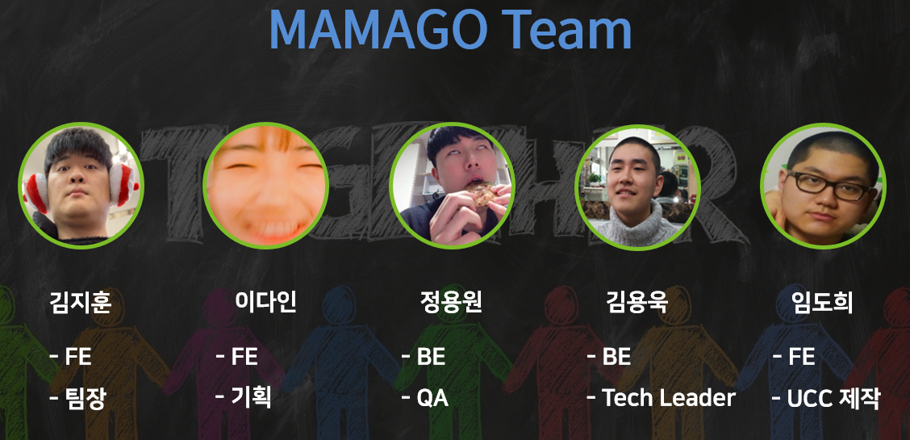
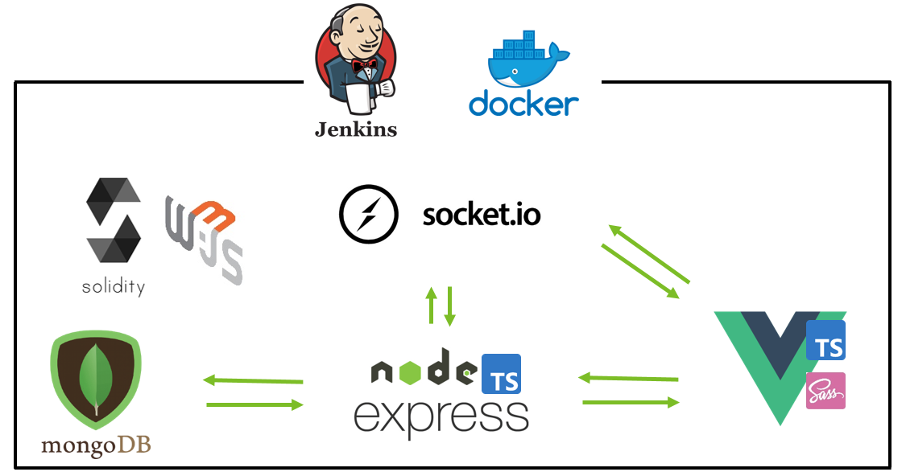
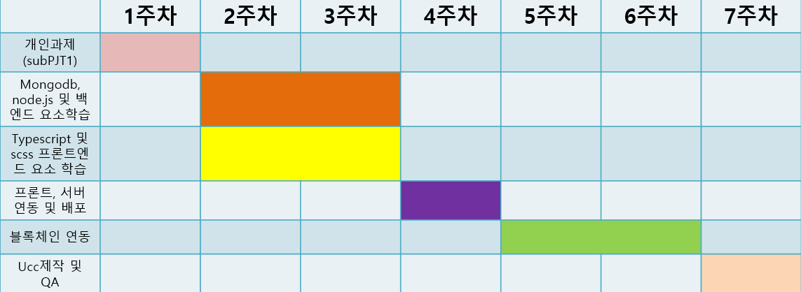

#### 민없민 팀을 소개합니다

> '민없민 팀이란?'
>
> ```
> 민석이란 친구를 중심으로 팀을 짜게 되었는데,
> 취업으로 인해 싸피를 떠나게 되어 같이할 수 없게 되었습니다.
> 그래서 '민석 없는 민석팀'이라는 의미를 담고 있습니다.
> ```

1. 팀원 :grin: 

   

2. 서비스 소개 :computer: (배포: http://j3b103.p.ssafy.io/)

   - 서비스명: 마마고 :baby_chick: 

   - 개요(목표)

     - 간단하게 통역을 이용해보세요!

     - 코로나로 인해 만나서 통역하기 두려우시죠?

       언택트시대에 걸맞게 화상통역을 도와주시고 '알'을 받아 가세요! :egg: 

       `알` 이란? 마마고 서비스에서 통용되는 화폐단위입니다. (1알 = 1이더리움)

     - 해외여행 중 긴급하게 통역을 해야할 일이 있는데 통역가를 구하기 힘드셨죠?
     
        마마고를 사용해 손쉽게 통역가를 구해보세요.
     
     - 통역가의 실력과 신뢰도를 측정하기 힘드셨죠?
     
       블록체인을 이용해 내역과 경력을 증명해주는 저희 서비스를 한번 이용해보세요! :)

3. 개발 언어 :page_with_curl:  및 Setting 

   > **1. 이미 로컬에 환경구축되어있다면 설치할 필요가 없습니다.**
   >
   > **2. Front, Back 다 npm을 사용, git pull 이후 npm i를 통해 패키지 업데이트를 해주세요.**

   **frontend**

   - Vue.js
   - Scss
   - TypeScript
   - Vuetify

   ```bash
   npm i typescript vuex router sass-loader node-sass
   vue add vue-router vuex @vue/typescript
   ```

   **backend**

   - express
   - mongoDB

   ```bash
   npm init
   npm i --save express typescript ts-node cors body-parser
   npm i mongodb
   npm i mongoose
   
   npm i @types/node @types/express nodemon
   npm i @types/mongodb
   npm i @types/mongoose
   ```

   

   **+**

   - Docker
   - solidity
   - geth
   - web3.js
   - socketio - webrtc
   - Jenkins

   

   ### 기술스택

   

4. git 충돌해결

   ```bash
   1. 내가 작업하고 있는 브랜치의 상위 브랜치(기본 브랜치)로 간다.
   $ git checkout develop
   
   2. 최신 작업파일들로 패치해준다.
   $ git pull origin develop
   
   3. 충돌이 났던 가지로 간다.
   $ git checkout [브랜치명]
   
   4. 머지를 해서 충돌이 난 부분을 고쳐준다.
   $ git merge develop
   
   그리고 나서 다시 git add, commit, push, pull request를 하면 해결
   
   해결을 다해서 pull request를 하기 전에 다른 사람이 올린게 새로 업데이트되서 master가 변경된다면 다시 충돌
   ```

5. 개발일정

   


